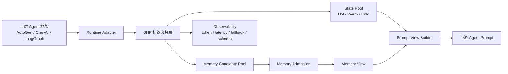
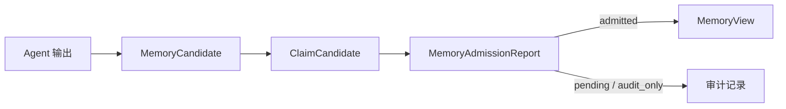

# 跨框架多 Agent 低开销协同运行时系统报告骨架

## 1. 项目定位

本项目面向赛题第九题，目标是实现一个可嵌入多种 Agent 框架的运行时层，用于降低多 Agent 连续协作过程中的通信 token、上下文膨胀、重复记忆读取和协议失稳成本。

系统不替代 AutoGen、CrewAI、LangGraph 等上层框架的 Agent 编排能力，而是在 Agent 之间提供统一的运行时通信层：

- 上层框架仍负责角色、工具和任务流程。
- 本系统负责结构化交接、状态池、记忆候选准入、生命周期治理和成本观测。
- 适配方式是通过 adapter 接管 Agent 间 message handoff，而不是强制重写上层框架。

## 2. 赛题要求映射

| 赛题关注点 | 本系统对应实现 | 当前证据 |
| --- | --- | --- |
| 多 Agent 协同机制 | `baseline_text` 与 `runtime_lite` 两种运行模式 | `examples/run_competition_eval.py` 可一键生成对比报告 |
| 低开销通信 | SHP 短交接包 + Prompt View + 非文本状态引用 | MiMo A+B `llm_total_tokens` 下降 94.66% |
| 非文本中间状态 | `embedding_state`、`retrieval_state`、`artifact_state` 的 state_ref 传递 | state pool 中保存结构化 payload 与 audit payload |
| 连续任务记忆复用 | MemoryCandidate -> MemoryAdmissionReport -> MemoryView | A/B 连续任务 memory_hit_rate 为 1.0 |
| 鲁棒性 | Provider Response Guard、Contract Guard、格式修复、fallback 观测 | MiMo A/B `fallback_count=0` |
| 性能对比数据 | provider usage token、系统端到端 token、延迟、成功率、schema 完整度 | `runs/v5.0-mimo-full-report/competition_report.md` |

## 3. 系统总体架构



## 4. 三个创新方案的落地方式

### 4.1 SHP-State：短协议包与非文本状态传递

Agent 之间不直接传完整自然语言正文，而是传递 SHP 控制头和 `state_ref`。

一个 `state_ref` 至少包含：

```json
{
  "state_id": "state_xxx",
  "state_type": "retrieval_state",
  "version": 1,
  "payload_kind": "structured_non_text",
  "contains_embedding_refs": false,
  "usage_hint": "summary_context_selection",
  "tier": "hot"
}
```

生成方式：

- Retriever 生成 `retrieval_state`，包括 chunk、source、score、rank 等检索元数据。
- Writer / Reviewer 生成 `artifact_state`，保存产物摘要、sha256、audit payload 引用。
- 后续可扩展真实 `embedding_state`，保存 embedding id、vector dim、相似度分数引用。

传递方式：

- SHP 只携带 `state_ref`，不携带完整正文。

接收方式：

- 下游 Agent 通过 State Access API 读取 Prompt View。
- 默认只读 summary / evidence snippet，不直接读取 raw content。

后续使用：

- Writer / Reviewer 根据角色读取裁剪视图。
- Final task 可读取 deliverable view，聚合最终交付所需记忆。

### 4.2 TLC-Memory：记忆候选池与可控准入

系统不把所有中间输出直接写入长期记忆，而是经过候选池：



作用：

- 避免无关内容污染记忆池。
- 保留 `useful_memory_hit_count`、`wrong_memory_hit_count` 等指标，证明命中记忆确实有用。
- 将长期复用内容和当前轮临时状态分开。

### 4.3 CSCC-Lifecycle：成本感知一致性与生命周期治理

当前实现包括：

- Preflight Validation：高成本生成前先检查读集是否过时。
- Read Lease-lite：读取状态时记录活跃读者，避免 GC 与读取并发冲突。
- State GC / Tombstone：任务结束后可回收冷状态，同时保留审计指针。
- Retry Budget：格式修复重试有 token 预算，避免重试成本失控。

作用：

- 防止乐观锁冲突导致长文本重写。
- 防止后台 GC 删除正在读取的 payload。
- 防止格式错误导致整轮实验崩溃。

## 5. v5.0 交付硬化

v5.0 新增统一比赛评测入口：

```powershell
F:\software\anaconda\envs\multi-agent-demo\python.exe examples\run_competition_eval.py --provider mimo --suite A --suite B --config configs\llm.mimo.example.json
```

也可以复用已有实验结果，只生成报告：

```powershell
F:\software\anaconda\envs\multi-agent-demo\python.exe examples\run_competition_eval.py --provider mimo --skip-run --suite A --suite B --existing-run A=runs\v4.2-mimo-full-a --existing-run B=runs\v4.2-mimo-full-b --output-root runs\v5.0-mimo-full-report
```

输出文件：

- `competition_report.json`
- `competition_report.md`

固定记录：

- provider usage token：`llm_prompt_tokens`、`llm_completion_tokens`、`llm_total_tokens`
- 系统内部协作 token：`end_to_end_collaboration_tokens`
- 延迟：`latency_ms`
- 成功率：`success_count / task_runs`
- 协议稳定性：`fallback_count`、`contract_retry_count`
- Provider 稳定性：`provider_response_retry_count`
- 交付完整性：`deliverable_schema_hit_count / deliverable_schema_required_count`
- 记忆质量：`wrong_memory_hit_count`、`useful_memory_hit_count`

## 6. 当前实验结果摘要

MiMo provider 下，A/B 两组 20 个连续任务的结果：

| 指标 | baseline_text | runtime_lite | 变化 |
| --- | ---: | ---: | ---: |
| task_runs | 20 | 20 | 0 |
| success_count | 20 | 20 | 0 |
| latency_ms | 2,271,031 | 1,734,706 | -23.62% |
| llm_prompt_tokens | 4,198,454 | 106,473 | -97.46% |
| llm_completion_tokens | 200,332 | 128,538 | -35.84% |
| llm_total_tokens | 4,398,786 | 235,011 | -94.66% |
| end_to_end_collaboration_tokens | 6,166,235 | 116,161 | -98.12% |
| fallback_count | 0 | 0 | 0 |
| contract_retry_count | 0 | 0 | 0 |

解释：

- token 大幅下降，说明系统没有依赖完整历史上下文进行 Agent 间交接。
- 延迟下降 23.62%，说明短上下文也带来了实际时间收益。
- 延迟降幅小于 token 降幅，因为当前每个任务仍串行调用 5 个 Agent，LLM 调用次数没有减少。
- `fallback_count=0`，说明 v4.2/v5.0 当前协议链路稳定。
- runtime_lite 新增记忆读取 token，但规模远小于 baseline 完整历史 token，未出现明显 cost shifting。

## 7. 质量评估口径

v5.0 默认采用确定性质量门禁，不额外消耗 LLM token：

| 检查项 | 含义 |
| --- | --- |
| `success_rate_100_percent` | 所有任务成功完成 |
| `fallback_count_zero` | 没有发生降级兜底 |
| `contract_retry_count_zero` | 没有发生协议格式重试 |
| `final_schema_complete` | 最终交付字段完整 |
| `wrong_memory_hit_count_zero` | 没有错误记忆命中 |
| `raw_access_count_zero` | 没有通过读取 raw content 转移成本 |

后续可选增强：

- 增加 judge LLM 对最终交付物进行语义质量评分。
- Judge 只读取最终任务交付物，不参与 runtime 协作成本统计。
- 报告中必须区分“运行成本”和“评测成本”。

## 8. 跨框架适配方案

比赛版建议先实现最小 adapter 层：

```python
class RuntimeAdapter:
    def send_message(self, sender, receiver, message): ...
    def write_state(self, agent_id, payload): ...
    def read_prompt_view(self, state_refs, memory_refs): ...
    def promote_memory(self, candidate): ...
    def run_agent_step(self, agent, task, context): ...
```

AutoGen 等框架的接入方式：

- 在 Agent reply / handoff 回调处接入 `send_message`。
- 将大段正文写入 `StatePool`，只把 `state_ref` 放入框架消息。
- 下游 Agent 调用前，由 adapter 生成 Prompt View。
- 记忆候选准入异步执行，不阻塞主 Agent 链路。

## 9. 局限与后续工作

当前局限：

- 每个任务仍串行调用 5 个 Agent，延迟下降受 LLM 调用次数限制。
- 当前 `embedding_state` 仍以结构化接口预留为主，真实向量后端可在后续接入。
- v5.0 默认质量门禁是确定性规则，不等价于完整语义 judge。

下一步：

- v5.1：实现 AutoGen 最小 adapter 原型。
- v5.2：加入可选 judge LLM 质量评估，并严格区分评测成本和运行成本。
- v5.3：将可视化报告接入本地 monitor，展示 token、延迟、状态流转和记忆命中。
