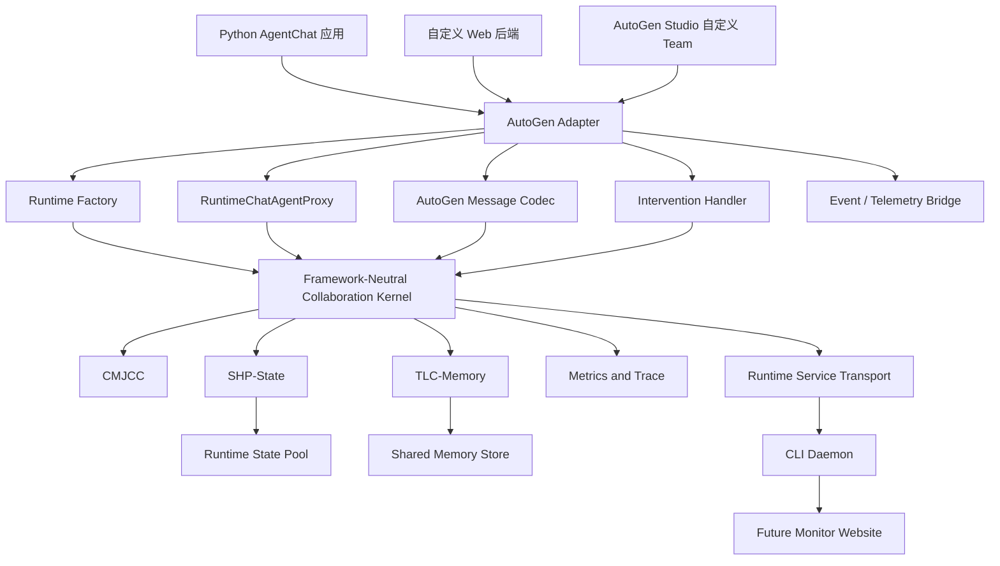

# AutoGen 接入调研与实施建议

调研日期：2026-06-24

## 1. 调研目的

本文回答以下问题：

1. AutoGen 当前有哪些主要使用方式；
2. 我们的低开销协作运行时应接入 AutoGen 的哪一层；
3. 安装包、终端服务、Python 项目和网页项目分别如何使用；
4. “接管底层 Agent 协作”可以做到什么，不能承诺什么；
5. 现有工程需要怎样重构，才能实现真正的跨框架运行时；
6. AutoGen 已进入维护模式后，项目路线是否仍然合理。

本文以 AutoGen 0.7.5 的官方文档和源码为主要依据，并对照本项目三份最终创新方案：

- CMJCC：通信-记忆联合开销控制；
- SHP-State：运行时状态化交接；
- TLC-Memory：时间生命周期共享记忆。

## 2. 核心结论

### 2.1 项目方向仍然成立

我们的系统不应替代 AutoGen，也不应重新实现 AutoGen 的全部调度逻辑。

更合理的边界是：

```text
AutoGen 决定：
  - 有哪些 Agent；
  - Agent 使用什么模型和工具；
  - 谁在什么时候发言；
  - 使用 RoundRobin、Selector、Swarm 或 GraphFlow 等协作方式；
  - 任务何时终止。

我们的运行时决定：
  - Agent 输出如何校验和结构化；
  - 中间结果是否写入 State Pool；
  - Agent 间传全文还是 SHP + state_refs；
  - 下游 Agent 实际获得什么 Prompt View；
  - 哪些候选信息进入 TLC-Memory；
  - 状态和记忆如何分层、复用、回收；
  - 如何记录通信成本、状态读取、记忆命中和重试。
```

因此，更准确的表述不是“完全接管 AutoGen”，而是：

> 在不改变 AutoGen Agent 角色、模型和主要编排语义的前提下，接管 Agent 协作的数据面，并为消息、状态、记忆和观测提供统一运行时。

这里的“数据面”指 Agent 之间实际传递和消费的内容；“控制面”指谁执行、何时执行和何时终止。

### 2.2 终端启动不等于自动接管

设想中的使用体验可以实现：

```powershell
pip install "agentlite-runtime[autogen,server]"
agentlite init
agentlite serve
```

启动后可以输出：

```text
AgentLite Runtime: http://127.0.0.1:8766
Runtime API:       http://127.0.0.1:8766/api
Monitor:           http://127.0.0.1:8765
Data directory:    ~/.agentlite
```

但仅启动服务，无法自动识别任意 Python 进程中的 Agent、消息接收者、任务边界和角色能力。

应用仍然需要通过以下任一方式接入：

1. Python 代码显式创建 AutoGen Adapter；
2. 使用本项目提供的 AutoGen Team 工厂；
3. AutoGen Studio 导入本项目的自定义 Team 组件；
4. 自定义 Web 后端在创建 AutoGen Team 时注入 Adapter。

如果完全不改代码，只做 HTTP 模型代理，系统最多能看到 LLM 请求和响应，无法可靠知道“哪个 Agent 在给哪个 Agent 交接”，也无法正确实现角色化 Prompt View、StateRef、MemoryRef 和生命周期治理。这种方式不能称为真正接管协作。

### 2.3 AutoGen 适合作为首个适配框架，但不能成为内核依赖

截至 2026-06-24：

- AutoGen 官方稳定版文档对应 0.7.5；
- AutoGen 官方仓库已明确进入维护模式，不再增加新功能；
- Microsoft 建议新项目使用 Microsoft Agent Framework 1.0；
- 官方已经提供 AutoGen 到 Microsoft Agent Framework 的迁移指南。

因此建议：

```text
比赛验证：
  优先完成 AutoGen Adapter，证明可接入主流框架。

工程设计：
  Collaboration Kernel 不导入任何 AutoGen 类型。

后续扩展：
  保留 Microsoft Agent Framework、LangGraph、CrewAI 等 Adapter SPI。
```

AutoGen 接入仍有比赛价值，因为其 AgentChat、Core、Studio 和多 Agent Team 形态适合展示本项目能力；但项目宣传应改为“以 AutoGen 为首个验证框架”，而不是“系统围绕 AutoGen 构建”。

## 3. AutoGen 当前的主要使用方式

### 3.1 AgentChat：高层 Python API

AgentChat 是大多数 Python 用户的入口，建立在 AutoGen Core 之上。

常见用法包括：

```text
单 Agent：
  AssistantAgent.run()
  AssistantAgent.run_stream()

多 Agent Team：
  RoundRobinGroupChat
  SelectorGroupChat
  Swarm
  MagenticOneGroupChat

结构化工作流：
  GraphFlow
```

主要特点：

- `RoundRobinGroupChat` 按固定顺序轮流发言；
- `SelectorGroupChat` 通过模型或自定义函数选择下一 Agent；
- `Swarm` 通过 `HandoffMessage` 决定交接目标；
- GroupChat 默认会把参与者消息发布给其他参与者；
- Team 支持 `run()`、`run_stream()`、`save_state()`、`load_state()`；
- `BaseGroupChat` 和具体 Team 构造函数允许传入自定义 `runtime`。

这意味着 AgentChat 已经提供了一个公开且相对稳定的 runtime 注入点。

### 3.2 AutoGen Core：底层事件驱动运行时

Core 使用 Actor 模型，支持：

- `RoutedAgent`；
- 类型化消息；
- direct message，即点对点请求/响应；
- publish/subscribe，即主题广播；
- `SingleThreadedAgentRuntime`；
- 实验性的 gRPC Distributed Agent Runtime；
- Agent 生命周期管理；
- structured logging 和 OpenTelemetry。

Core 的 `InterventionHandler` 可以在运行时处理消息时：

- 观察消息；
- 修改消息；
- 丢弃消息；
- 分别处理 send、publish 和 response。

但官方明确说明，当前只有 `SingleThreadedAgentRuntime` 支持 Intervention Handler。分布式 runtime 不能直接依赖这套拦截机制。

### 3.3 AutoGen Studio：网页端低代码原型

AutoGen Studio 是建立在 AgentChat 上的网页原型工具，支持：

- 可视化构建 Agent 和 Team；
- Playground 中运行 Team；
- 实时查看消息流；
- 查看 token、轮次和工具调用；
- 使用 JSON 声明式配置；
- 导入 Gallery；
- 通过 `TeamManager` 在 Python 中运行导出的 Team 配置。

需要注意：

- 官方明确将 Studio 定位为原型和演示工具，不是生产系统；
- PyPI 上的 `autogenstudio` 当前版本为 0.4.2.2；
- AutoGen AgentChat 当前版本为 0.7.5；
- AutoGen 仓库中 Studio 的依赖范围仍限制 `autogen-core`、`autogen-agentchat` 和 `autogen-ext` 小于 0.7。

因此 Studio 接入必须使用独立、固定版本的测试环境，不能默认与最新 AgentChat 环境混装。

### 3.4 自定义网页应用

很多“网页端使用 AutoGen”的项目并不使用 AutoGen Studio，而是：

```text
浏览器前端
  ↓ HTTP / WebSocket
Python Web 后端
  ↓
AutoGen AgentChat / Core
```

这种情况下，我们只需要接入 Python 后端。前端仍然接收流式事件或最终结果，不需要理解 StatePool、MemoryStore 或 SHP。

这是网页端最容易、最稳定的接入方式。

## 4. 为什么不能只靠 Intervention Handler

Intervention Handler 是重要接入口，但它不能独立完成三套创新方案。

原因如下：

### 4.1 广播消息缺少接收者上下文

AutoGen GroupChat 使用发布/订阅广播。`on_publish` 可以看到发布消息，但不能针对每个接收 Agent 分别生成不同内容。

而 SHP-State 要求：

```text
Planner 读取调度视图；
Retriever 读取检索视图；
Writer 读取写作视图；
Reviewer 读取审查视图。
```

因此，同一个 `state_ref` 必须在 Agent 输入边界按角色渲染不同 Prompt View。

### 4.2 消息压缩后仍需在接收侧展开

如果 Handler 把长文本替换成 `summary + state_refs`，下游普通 `AssistantAgent` 并不知道怎样读取 State Access API。

必须增加一个接收侧代理：

```text
AutoGen 消息
  ↓
RuntimeChatAgentProxy
  ↓
解析 SHP / StateRef / MemoryRef
  ↓
按角色渲染 Prompt View
  ↓
调用原始 AssistantAgent
```

### 4.3 Agent 输出需要完整后处理链

Agent 输出后还要经过：

```text
Provider Response Guard
→ Output Contract Guard
→ 状态提取和准入
→ StatePool 写入
→ Memory Candidate
→ SHP 构建
→ 指标记录
```

这不是简单的日志钩子可以完成的。

### 4.4 分布式 runtime 不支持同样的 Handler

官方将 AutoGen 分布式 runtime 标为实验能力，而且 Intervention Handler 当前只支持单线程 runtime。

因此我们必须把核心逻辑放在框架无关的 Agent Proxy 和 Runtime Service 中，不能把全部能力写死在 Handler 里。

## 5. 推荐的总体接入架构



### 5.1 AutoGen 保留编排，Kernel 接管协作数据

第一版 Adapter 不应强制替换：

- RoundRobin 的轮转顺序；
- Selector 的 speaker selection；
- Swarm 的 Handoff 目标；
- GraphFlow 的边和条件；
- AutoGen 的 termination condition。

第一版应接管：

- 每个 Agent 实际收到的上下文；
- 每个 Agent 输出的契约检查；
- 输出到状态对象的转换；
- Agent 间的 SHP 交接；
- State-to-Memory Bridge；
- 运行时指标。

后续可以提供可选的 Routing Advisor，把 CMJCC Capability Router 的建议返回给 Selector 或 Swarm，但它不应成为首个 AutoGen 版本的前置条件。

### 5.2 Framework-Neutral Collaboration Kernel

必须从当前 `V0Runtime` 中拆出框架无关内核。

建议公开以下事件接口：

```python
session = kernel.open_session(
    framework="autogen",
    external_session_id="...",
    metadata={...},
)

prepared_input = kernel.before_agent_receive(
    session_id=session.id,
    agent=agent_descriptor,
    incoming_messages=normalized_messages,
)

processed_output = kernel.after_agent_output(
    session_id=session.id,
    agent=agent_descriptor,
    raw_output=raw_output,
)

handoff = kernel.before_handoff(
    session_id=session.id,
    sender=sender,
    receiver=receiver,
    processed_output=processed_output,
)

kernel.close_session(session.id)
```

其中：

```text
before_agent_receive:
  获取 read lease；
  解析 state_refs / memory_refs；
  按角色渲染 Prompt View；
  记录状态和记忆读取成本。

after_agent_output:
  运行 Provider / Contract Guard；
  提取 Artifact、Claim、Memory Candidate；
  写入 StatePool；
  构建可传递的 SHP。

before_handoff:
  执行 Communication Gate；
  做引用校验；
  生成框架无关 HandoffEnvelope。
```

当前自研 `V0Runtime` 应退化为这个 Kernel 的 `CustomAgentAdapter`，而不是继续同时承担 Agent 调度和运行时治理。

### 5.3 AutoGen Adapter 的五个组成部分

#### A. Runtime Factory

负责创建：

```python
SingleThreadedAgentRuntime(
    intervention_handlers=[AgentLiteInterventionHandler(...)]
)
```

并将该 runtime 传给 AutoGen Team。

#### B. RuntimeChatAgentProxy

包装现有 `BaseChatAgent` 或 `AssistantAgent`。

职责：

1. 接收 AutoGen 消息；
2. 转为本项目 NormalizedMessage；
3. 调用 `before_agent_receive()`；
4. 把 Prompt View 交给原 Agent；
5. 接收原 Agent 的完整输出；
6. 调用 `after_agent_output()`；
7. 返回适合 AutoGen Team 继续运行的消息。

Proxy 必须代理：

- `name`、`description`；
- `on_messages()`、`on_messages_stream()`；
- `reset()`；
- `save_state()`、`load_state()`；
- `produced_message_types`。

#### C. AutoGen Message Codec

负责映射 AutoGen 消息与本项目对象。

建议至少支持：

| AutoGen 对象 | 本项目处理 |
|---|---|
| `TextMessage` | Artifact / summary / SHP |
| `HandoffMessage` | handoff target、action、required capabilities |
| 多模态消息 | artifact_state + file/media ref |
| 工具调用请求 | tool intent / execution state |
| 工具执行结果 | artifact_state 或 failure_state |
| `StopMessage` / termination | session end / final deliverable |

跨框架内核不能直接保存 AutoGen 类实例，应保存稳定的内部数据结构和 `framework_metadata`。

#### D. Intervention Handler

Handler 用于：

- 全局事件观测；
- message id 和 trace id 注入；
- send/publish/response 统计；
- 明显非法消息阻断；
- 终止和异常事件捕获。

它是辅助层，不是完整接管层。

#### E. Event / Telemetry Bridge

接收 AutoGen structured logging、LLM usage event 和 OpenTelemetry span，并映射到本项目：

- `trace.jsonl`；
- agent latency；
- LLM prompt/completion token；
- retry；
- message send/publish；
- tool execution；
- runtime local overhead。

这样可以避免重复发明 AutoGen 已经提供的观测入口。

## 6. 安装包与终端使用方式

### 6.1 建议的包结构

```text
agentlite-runtime
├── agentlite
│   ├── kernel/
│   ├── protocol/
│   ├── state/
│   ├── memory/
│   ├── reliability/
│   ├── transport/
│   ├── server/
│   ├── cli/
│   └── adapters/
│       ├── base.py
│       ├── custom.py
│       └── autogen/
│           ├── runtime_factory.py
│           ├── agent_proxy.py
│           ├── intervention.py
│           ├── message_codec.py
│           ├── team_factory.py
│           └── studio_component.py
```

建议使用可选依赖：

```toml
[project.optional-dependencies]
autogen = [
  "autogen-agentchat==0.7.5",
  "autogen-core==0.7.5",
]
autogen-openai = [
  "autogen-ext[openai]==0.7.5",
]
studio = [
  "autogenstudio==0.4.2.2",
]
server = [
  "fastapi",
  "uvicorn",
]
```

Studio 依赖与 AgentChat 0.7.5 存在版本边界，实际发布时应：

1. 给 Studio 建独立 extra 和独立环境；
2. 建立 AgentChat 0.7.5 与 Studio 兼容版本两套 CI；
3. 不允许用户在同一环境中盲目安装全部 extras。

### 6.2 CLI 命令设计

建议提供：

```text
agentlite init
  生成本地配置、数据目录和示例。

agentlite serve
  启动 Runtime API、StatePool、MemoryStore 和事件服务。

agentlite status
  显示服务地址、会话数、状态数、记忆数和健康状态。

agentlite doctor
  检查 Python、AutoGen 版本、端口、写权限和依赖冲突。

agentlite run -- python app.py
  为已接入 Adapter 的应用注入 endpoint、session 和 trace 环境变量。

agentlite autogen example
  运行最小 AutoGen 接入示例。

agentlite autogen-studio
  使用固定版本环境和自定义 AgentLite Team 组件启动 Studio。

agentlite stop
  优雅停止本地服务。
```

`agentlite run` 只是启动便利命令，不能依赖隐式 monkey patch 自动修改任意 AutoGen 程序。

### 6.3 运行模式

建议支持两种模式：

#### Embedded Mode

Kernel、StatePool 和 MemoryStore 与 AutoGen 在同一 Python 进程。

优点：

- 实现简单；
- 调试方便；
- 延迟最低；
- 适合比赛最小原型。

缺点：

- 多个应用不能共享统一运行时；
- 进程退出后需要依赖持久化恢复；
- 终端服务感较弱。

#### Service Mode

AutoGen Adapter 通过本地 Socket 或 HTTP 连接 `agentlite serve`。

优点：

- Python、Studio、自定义 Web 后端可以共享统一服务；
- 监控网站可以读取统一事件；
- 更符合跨框架运行时定位；
- 后续可部署到 openEuler。

缺点：

- 需要会话隔离、认证、超时和断线恢复；
- State Access API 会增加本地 RPC；
- 需要处理客户端与服务端版本兼容。

建议开发顺序：

```text
先完成 Embedded Mode 的正确性；
再把同一 Kernel 暴露为 Service Mode；
不要一开始就把所有内部调用网络化。
```

## 7. Python AgentChat 的目标使用方式

以下是建议接口，不代表当前代码已经实现。

```python
from autogen_agentchat.agents import AssistantAgent
from autogen_agentchat.teams import RoundRobinGroupChat
from agentlite.adapters.autogen import AgentLiteAutoGenBridge

bridge = AgentLiteAutoGenBridge.connect_from_env()

planner = AssistantAgent(
    "planner",
    model_client=model_client,
    system_message="负责拆解任务。",
)
writer = AssistantAgent(
    "writer",
    model_client=model_client,
    system_message="负责生成最终内容。",
)

team = RoundRobinGroupChat(
    participants=[
        bridge.wrap_agent(planner, role="planner"),
        bridge.wrap_agent(writer, role="writer"),
    ],
    runtime=bridge.autogen_runtime,
    max_turns=6,
)

result = await team.run(task="完成任务")
```

用户仍然在 AutoGen 中配置：

- 模型；
- API key；
- Agent 角色；
- 工具；
- Team；
- 终止条件。

本项目不重复保存这些 LLM 配置，只读取运行时事件和输出。这样与我们此前“LLM 配置属于实验或宿主框架，不属于跨框架内核”的判断一致。

## 8. 网页端的两种接入方式

### 8.1 自定义网页应用

推荐架构：

```text
浏览器
  ↓
FastAPI / Flask / Django 后端
  ↓
AgentLite AutoGen Adapter
  ↓
AutoGen Team
  ↓
AgentLite Runtime Service
```

网页前端只需要处理：

- 用户任务；
- 流式 Agent 事件；
- 最终结果；
- 可选的运行时指标链接。

不需要在浏览器中实现我们的状态池。

### 8.2 AutoGen Studio

建议提供一个可序列化的自定义 Team 组件：

```text
agentlite.adapters.autogen.AgentLiteRoundRobinGroupChat
agentlite.adapters.autogen.AgentLiteSelectorGroupChat
```

组件内部负责：

1. 从 JSON 读取 AgentLite endpoint 和策略；
2. 加载原始 participants；
3. 包装每个 Agent；
4. 创建带 Handler 的 runtime；
5. 调用标准 AutoGen Team。

然后提供 Gallery JSON，用户在 Studio 中导入即可看到 AgentLite Team。

CLI 可以封装启动过程：

```powershell
agentlite autogen-studio --port 8080
```

输出：

```text
AutoGen Studio: http://127.0.0.1:8080
AgentLite Runtime: http://127.0.0.1:8766
AgentLite Monitor: http://127.0.0.1:8765
```

不建议直接修改 AutoGen Studio 源码，也不建议长期依赖其私有 `TeamManager` 内部实现。自定义 Component + Gallery 比 monkey patch 更容易复现和答辩。

## 9. 与三份创新方案的映射

### 9.1 CMJCC

AutoGen 接入点：

```text
Agent 输出
  → RuntimeChatAgentProxy.after_agent_output
  → Output Contract Guard
  → Typed Artifact Digest
  → Communication Gate
  → SHP
```

AutoGen 的 Team 决定下一 Agent；CMJCC 决定交给它什么信息。

### 9.2 SHP-State

AutoGen 接入点：

```text
上游 Agent 完整产物
  → State Admission
  → Runtime State Pool
  → AutoGen 消息只携带 summary + state_refs
  → 下游 RuntimeChatAgentProxy
  → State Access API
  → 角色化 Prompt View
```

这证明系统不是“把文本放数据库后只传 ID”，因为 Adapter 还承担：

- 状态类型映射；
- 引用校验；
- 读租约；
- 角色化渲染；
- 消费记录；
- GC；
- 状态到记忆的晋升。

### 9.3 TLC-Memory

AutoGen 接入点：

```text
Agent Output Contract 中的 memory_card / claim_cards
  → Memory Candidate
  → Schema Registry
  → Rule-first Admission Lite
  → MemoryStore
  → MemoryView
  → 后续 Agent 或后续任务按需读取
```

记忆准入继续遵循现有方案：

- 规则优先；
- 写入路径不做重型全库 LLM 冲突判断；
- Raw State 不直接进入 Memory Pool；
- 高价值状态先经过 Promotion View 和 Memory Candidate。

## 10. 现有工程与目标之间的差距

当前已有：

- SHP envelope；
- StatePool 的 Hot/Warm/Cold 分层；
- StateRef、Prompt View、Read Lease、GC；
- embedding/retrieval/artifact 等状态；
- MemoryCandidate、ClaimCandidate、MemoryView；
- Contract Guard 和 Provider Guard；
- 成本与延迟指标；
- 本地 monitor 原型。

当前缺少：

| 缺口 | 影响 |
|---|---|
| 没有 `adapters/` 包 | 无法接入 AutoGen |
| `V0Runtime` 同时负责调度和治理 | AutoGen 接入会与现有 Agent 循环冲突 |
| 没有 framework-neutral Kernel API | 后续每个框架都要复制逻辑 |
| 没有 CLI entry point | 不能作为安装后可启动的工具 |
| 没有 Runtime Service / Transport | Python、Studio、Web 不能共享运行时 |
| 没有 AutoGen Message Codec | 无法稳定映射消息、工具结果和 Handoff |
| 没有 Agent Proxy | 不能实现角色化 Prompt View |
| 没有 session / namespace 隔离 | 多个 AutoGen Team 可能污染状态和记忆 |
| 没有 Adapter 兼容测试矩阵 | AutoGen/Studio 版本差异会导致安装和运行失败 |

最重要的重构不是先写 AutoGen import，而是先拆分：

```text
当前：
V0Runtime = 调度器 + Agent 循环 + 三线治理 + 实验逻辑

目标：
CollaborationKernel = 三线治理
CustomAgentAdapter = 当前自研调度
AutoGenAdapter = AutoGen 调度
BenchmarkHarness = 实验与对比
```

## 11. 推荐实施阶段

### 阶段 A：定义跨框架内核边界

交付：

- `CollaborationKernel`；
- `FrameworkAdapter` Protocol；
- normalized message / agent / session 数据模型；
- 把现有 `V0Runtime` 改为 Kernel 的调用方；
- 原有测试继续通过。

验收：

- 不安装 AutoGen 也能运行全部原实验；
- Kernel 中没有 `autogen_*` import。

### 阶段 B：AutoGen Core 最小桥接

交付：

- `AutoGenMessageCodec`；
- `AgentLiteInterventionHandler`；
- 自定义 runtime factory；
- 两个 `RoutedAgent` 的 direct message 与 publish 示例。

验收：

- send、publish、response 都进入 trace；
- 能写入真实 StatePool；
- 能生成 SHP。

### 阶段 C：AgentChat Agent Proxy

交付：

- `RuntimeChatAgentProxy`；
- `RoundRobinGroupChat` 示例；
- 角色化 Prompt View；
- Output Contract Guard；
- StateRef / MemoryRef 消费。

验收：

- 至少 3 个 Agent；
- 上游完整内容进入 StatePool；
- Team 中流转的是紧凑 SHP；
- 下游获得按角色渲染的 Prompt View；
- 最终输出保持完整。

### 阶段 D：Selector / Swarm 兼容

交付：

- SelectorGroupChat；
- Swarm HandoffMessage 映射；
- termination、reset、save/load state；
- tool result 到 artifact_state/failure_state 的映射。

验收：

- 不改变 AutoGen 原有 speaker selection；
- Handoff target 不因 SHP 转换而丢失；
- Team 恢复后 StateRef 仍可校验。

### 阶段 E：CLI 和 Service Mode

交付：

- `agentlite init/serve/status/doctor/stop`；
- 本地 HTTP 或 Socket Transport；
- session namespace；
- 健康检查；
- endpoint 环境变量。

验收：

- 两个独立 Python 进程连接同一 Runtime Service；
- 状态按 session 隔离；
- 服务退出和客户端断线不会损坏存储；
- CLI 输出 API 和监控地址。

### 阶段 F：网页端

交付：

- 自定义 Web 后端示例；
- Studio 固定版本环境；
- 可序列化 AgentLite Team；
- Gallery JSON；
- `agentlite autogen-studio`。

验收：

- 浏览器任务真实经过 AgentLite Adapter；
- 页面中显示的是 AutoGen 运行结果；
- monitor 能看到同一 session；
- 不是只读取 AutoGen 日志做旁路展示。

### 阶段 G：比赛实验

对同一 AutoGen Team 运行：

```text
autogen_native：
  标准 AutoGen 消息和上下文。

autogen_agentlite：
  相同 Agent、模型、工具、Team、任务和终止条件；
  只替换协作数据面。
```

报告必须分别展示：

- AutoGen 原生质量；
- AgentLite 接入后质量；
- provider token；
- direct message token；
- Prompt View token；
- retrieved memory token；
- retry token；
- latency；
- fallback；
- raw access；
- useful memory hit；
- task success。

这样得到的数据才是项目最终需要的框架内实验证据。

## 12. 主要风险

### 12.1 “零代码接管”承诺过度

风险：安装后只启动命令，却声称任意 AutoGen 应用自动被接管。

处理：明确要求应用选择 Adapter、Team Factory 或 Studio Component。

### 12.2 只拦消息，不改 Agent 输入

风险：消息虽然变成 StateRef，下游 Agent 不会读取，质量直接下降。

处理：Agent Proxy 是必需组件，Intervention Handler 只是辅助组件。

### 12.3 与 AutoGen 调度器争夺控制权

风险：CMJCC Router 和 Selector/Swarm 同时选择下一 Agent，产生双重路由。

处理：首版 AutoGen 拥有调度权，CMJCC Router 只提供能力校验和建议。

### 12.4 Studio 版本冲突

风险：Studio 与 AgentChat 最新版本混装失败或组件配置不兼容。

处理：固定版本、独立环境、独立 CI，不把 Studio 作为内核依赖。

### 12.5 AutoGen 维护模式

风险：只支持 AutoGen 会让项目很快显得过时。

处理：Kernel 与 Adapter 解耦；报告中把 AutoGen 定位为第一个验证框架，并将 Microsoft Agent Framework 列为下一 Adapter。

### 12.6 Service Mode 反而增加开销

风险：每次状态读取都经过 HTTP，降低 token 的同时增加大量 RPC 延迟。

处理：

- 同进程优先使用 Embedded Mode；
- Service Mode 支持批量读取；
- Hot metadata 本地缓存；
- payload 使用 file-ref、mmap-ref 或本地共享路径；
- 一次 handoff 只进行有限次数 RPC。

## 13. 最终建议

### 13.1 产品定位

建议正式表述为：

> AgentLite 是一个可嵌入、可服务化的跨框架多 Agent 协作运行时。它通过 Adapter 接入 AutoGen 等宿主框架，在保留宿主 Agent、模型、工具和编排语义的同时，统一接管结构化交接、运行时状态、共享记忆、可靠性守卫与成本观测。

### 13.2 首个可交付 AutoGen 版本

首版只需要完整支持：

1. AutoGen AgentChat 0.7.5；
2. `RoundRobinGroupChat`；
3. 3 个以上 `AssistantAgent`；
4. Embedded Mode；
5. Agent Proxy；
6. 自定义 `SingleThreadedAgentRuntime`；
7. TextMessage、HandoffMessage、工具结果三类映射；
8. StatePool、TLC-Memory、Contract Guard、指标全链路；
9. AutoGen native 与 AgentLite 两种模式对比。

不要在首版同时追求：

- 分布式 gRPC runtime；
- 所有 Team 类型；
- AutoGen Studio；
- 零代码 monkey patch；
- LangGraph、CrewAI、Microsoft Agent Framework 同时接入。

### 13.3 对当前路线的修正

原 v5 文档中的“AutoGenAdapter 最小示例”方向正确，但粒度不足。

应把 AutoGen 接入拆成：

```text
v5.12a：Framework-Neutral Kernel 边界
v5.12b：AutoGen Core Bridge
v5.12c：AgentChat Proxy + RoundRobin
v5.12d：CLI Embedded Demo
v5.13：Service Mode + Web/Studio
```

这不是增加新的创新点，而是把既定 v5“跨框架适配”目标拆成可验证工程步骤。

## 14. 官方资料

1. AutoGen 官方仓库及维护状态
   https://github.com/microsoft/autogen

2. AutoGen 官方首页与 AgentChat/Core/Studio 入口
   https://microsoft.github.io/autogen/stable/

3. AgentChat Teams API
   https://microsoft.github.io/autogen/stable/reference/python/autogen_agentchat.teams.html

4. AutoGen Core Message and Communication
   https://microsoft.github.io/autogen/stable/user-guide/core-user-guide/framework/message-and-communication.html

5. AutoGen Core Intervention Handler API
   https://microsoft.github.io/autogen/stable/reference/python/autogen_core.html

6. Distributed Agent Runtime
   https://microsoft.github.io/autogen/stable/user-guide/core-user-guide/framework/distributed-agent-runtime.html

7. AutoGen Studio
   https://microsoft.github.io/autogen/stable/user-guide/autogenstudio-user-guide/index.html

8. AutoGen Studio Usage 与 TeamManager
   https://microsoft.github.io/autogen/stable/user-guide/autogenstudio-user-guide/usage.html

9. AutoGen Component 序列化
   https://microsoft.github.io/autogen/stable/user-guide/agentchat-user-guide/serialize-components.html

10. AutoGen AgentChat PyPI
    https://pypi.org/project/autogen-agentchat/

11. AutoGen Studio PyPI
    https://pypi.org/project/autogenstudio/

12. AutoGen 到 Microsoft Agent Framework 迁移指南
    https://learn.microsoft.com/en-us/agent-framework/migration-guide/from-autogen/

13. Microsoft Agent Framework
    https://github.com/microsoft/agent-framework
